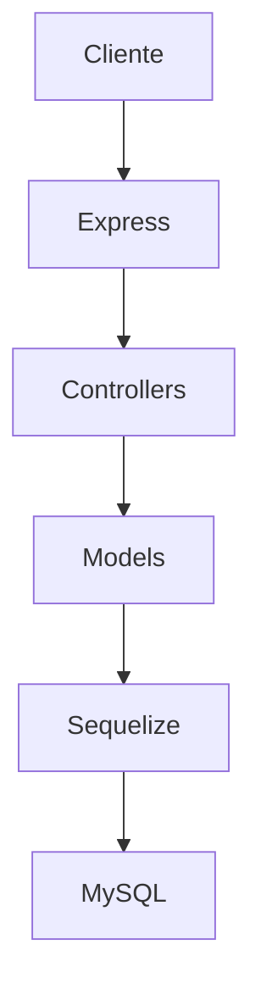

# 🏗 Arquitetura

A aplicação segue uma arquitetura MVC.

---

## Componentes

### Express

Responsável pelo roteamento.

---

### Controllers

Contêm a regra de negócio.

---

### Models

Representam as entidades do banco.

---

### Sequelize

Responsável pela comunicação com o banco de dados.

---

### MySQL

Persistência dos dados.