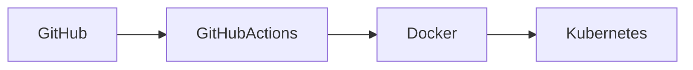

# ☁ Deploy

## Desenvolvimento

```bash
npm install
npm start
```

---

## Variáveis

| Variável | Descrição |
|----------|-----------|
| DB_HOST | Host do MySQL |
| DB_USER | Usuário |
| DB_PASSWORD | Senha |
| DB_NAME | Banco |

---

## Fluxo



---

!!! warning

    Nunca publique credenciais diretamente no repositório.